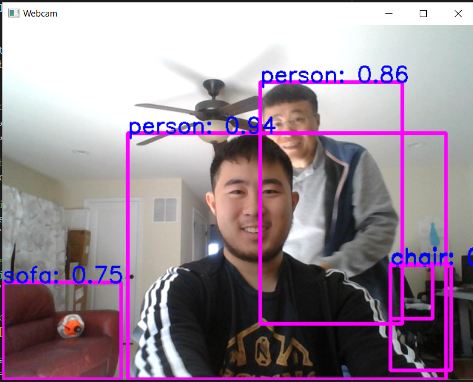

# YOLOv8 Webcam Test
This branch is to test how to use the webcam in conjunction with YOLOv8. I'm
looking at [this tutorial](https://dipankarmedh1.medium.com/real-time-object-detection-with-yolo-and-webcam-enhancing-your-computer-vision-skills-861b97c78993).

1. `pip install opencv-python`
    - I also had to `pip install opencv-contrib-python` to resolve some weird errors
2. Use this Python code to open up a webcam window:
    ```Python
    import cv2

    cap = cv2.VideoCapture(0)
    cap.set(3, 640)
    cap.set(4, 480)

    while True:
        ret, img= cap.read()
        cv2.imshow('Webcam', img)

        if cv2.waitKey(1) == ord('q'):
            break

    cap.release()
    cv2.destroyAllWindows()
    ```
3. Going to use coco128 (a global dataset) to train some pseudo data: `yolo train data=coco128.yaml model=yolov8n.pt epochs=10 lr0=0.01`
4. After training, we can use the `best.pt` found under the run
5. Use some math to draw the rectangle and display class name + confidence
6. Result:<br> 
